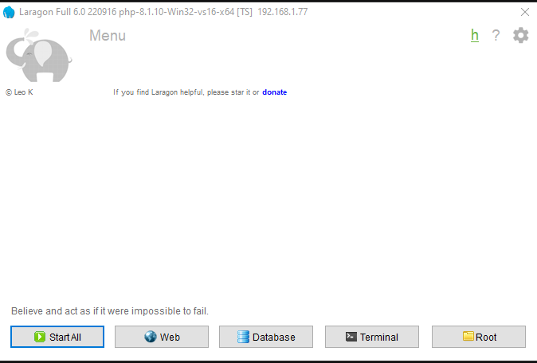
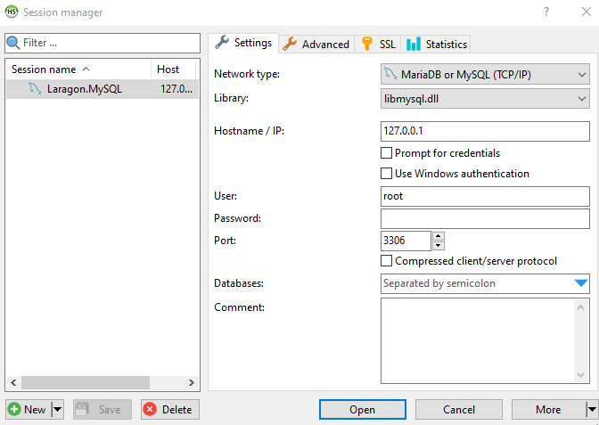
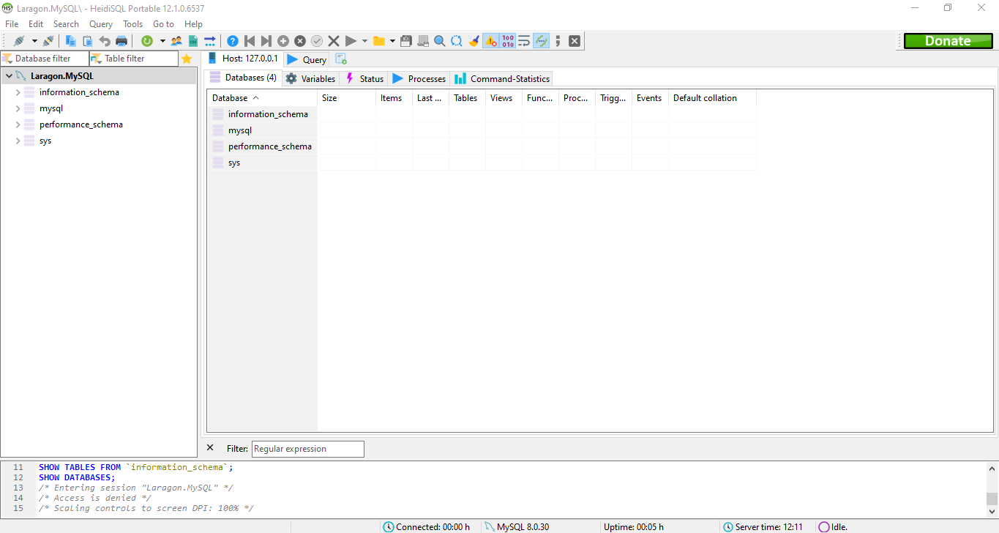

# **Instalasi**

## Instalasi Aplikasi Server

Seperti yang disinggung sebelumnya, Untuk mempermudah proses installasi kita akan menggunakn aplikasi server laragon. ikut langkah langkah berikut.

1. Kunjungi halaman resmi Laragon pada [Link Berikut]( https://laragon.org/)
2. Pada bagian **Edition**, Klik **Download Laragon - Full (173 MB)** untuk mengunduh aplikasi Laragon
3. Setelah proses downlod selesai, double klik pada file **laragon-wamp.exe** untuk melakukan installasi.
4. Klik **Next** dan **instal** sampai selesai, lalu klik **Finish**
5. Pada jendela aplikasi laragon yang terbuka, klik start all untuk menjalankan server web dan database.
6. cukup klik tanda ++x++ untuk me-minimize aplikasi laragon.

## Mengunduh Aplikasi

Untuk mengunduh aplikasi ini dilakukan langkah-langkah berikut:

1. kunjungi halaman release aplikasi pada [link berikut](https://github.com/masipnu/apg/releases/tag/v1.0)
2. Untuk kode sumber dalam format ZIP dengan  klik `Source code (zip)` pada bagian Assets.
3. Anda akan mendapatkan file `apg-1.0zip`.
4. Ekstrak file tersebut pada direktori `C:\laragon\ww`.
5. Anda akan mendapati direktori `apg-01`, silahkan rename menjadi `apg`.

## Instalasi Database 
Karena Aplikasi ini bekerja menggunakan database maka kita perlu mengatur databasenya terlebih dahulu sebelum dijalankan.

1. Buka Aplikasi Laragon.
   
2. Klik `Database` untuk membuka aplikasi manajemen database heiding SQL
    
3. Biarkan bagian Password (Kosong), lalu klik **Open**
    
4. Saat jendela heidi sql terbuka, Klik menu `File` > `RUn SQL file`, lalu arahkan ke file `apg.sql` yang berada didirektori `c:laragon\www\apg\database` dan klik **Open**. jika ada peringatan, klik **Yess**.
5. Selama tidak ada pesan `Errror`,berarti database sudah tersedia.
6. Tekan tombol ++f5++ pada jendela heiding SQl untuk me-refresh database, maka anda akan menekuman database `apg` lengkap dengan struktur tabel berserta contoh datanya.
7. Sekarang anda bisa menutup aplikasi Heiding SQL dan Me-Minimeze Laragon  

## Konfigurasi Aplikasi

setelah mengatur database, kita perlu melakukan konfigurasi database pada aplikasi APG.
Ikuti langkah-langkah berikut.

1. Buka file `config.php` pada direktori `C:\laragon\www\apg\library` dengan teks editor.
   Bisa Visual studio code atau Notepad.
2. Atur konfigurasi user dan password database pada baris berikut.
   
```PHP
<?php
$host = "localhost";
$user = "root"; 
$pass = "";
$db = "apg";

$con = mysqli_connect($host, $user, $pass, $db);

if (mysqli_connect_errno()) {
    echo "Koneksi gagal! : " . mysqli_connect_error();
}
?>
```

3. Karena pada user root tideak perlu memakai password, maka saya rubah `$user = "root";`  menjadi `$user = "";`.
4. Cukup ini saja dan Aplikasi Menejemen Pegawai siap dijalankan.