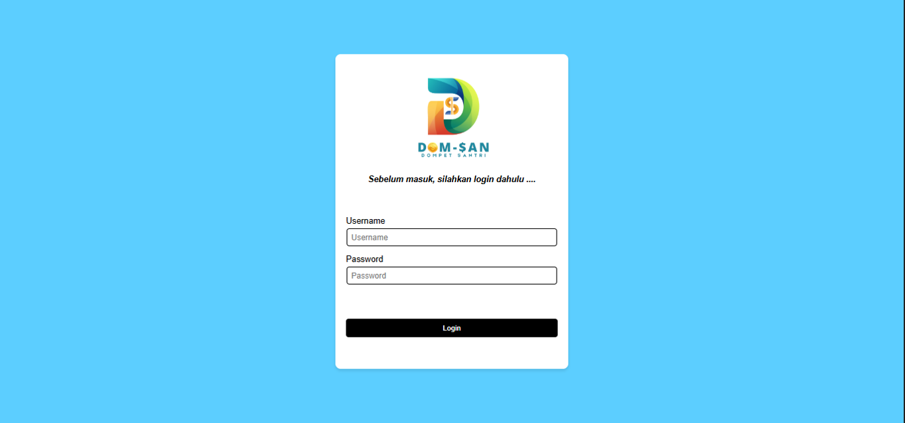
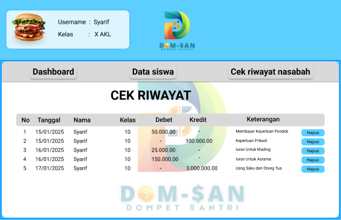
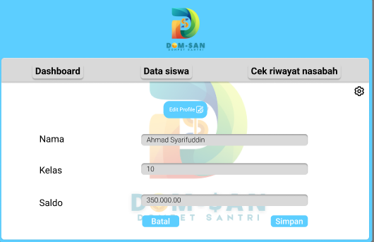
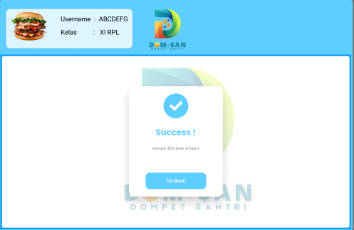

# **Panduan Penggunaan**

## Login Dan Hak Akses

1. Untuk memulai aplikasi anda bisa membuka browser dan memasukan alamat berikut[`http://localhost/apg`]
(http://localhost/apg).
2. Muncul tampilan halaman login.

3. Masukan username `admin` dan password `admin` untuk login sebagai administator,lalu klik **login**.
4. Selamat anda masukan kehalaman dasboard.

5. Untuk keluar anda bisa klik menu **Keluar** pada sidebar.

## Dasboard Utama

Dashboard Dompet Santri bisa menampilkan berbagai informasi keuangan dan fitur yang berguna bagi santri dalam mengelola keuangan mereka. Berikut adalah beberapa elemen utama yang bisa dimasukkan dalam dashboard:
.

1. Riwayat Nasabah
   
2. Kategori Pengeluaran

## Manajemen Data Santri

Berikut adalah struktur isi Manajemen Data Santri, yang bisa digunakan dalam sistem administrasi pesantren untuk mengelola data santri secara efektif:

1. Data Santri

2. Manejemen Keuangan Santri
   
### Menampilkan Data Santri

Fitur Menampilkan Dompet Santri memungkinkan pengelolaan keuangan santri secara transparan dan mudah diakses oleh pihak yang berwenang (admin, wali santri). Berikut adalah struktur dan isinya:

1. Akses Menu Dompet Santri
2. Tampilan Ringkasan Dompet Santri
3. Rincian Transaksi Dompet

### Menambah Data Santri

Fitur Menambah Data Santri digunakan untuk memasukkan data santri baru ke dalam sistem secara sistematis dan mudah. Berikut adalah struktur isinya:

1. Akses Menu Tambah Data Santri.

2. Formulir Input Data Santri.

### Menghapus Data Santri

Fitur Menghapus Data Santri digunakan untuk menghapus data santri yang sudah tidak aktif atau perlu diperbarui. Proses ini harus dilakukan dengan hati-hati agar tidak menghilangkan data penting.

1. Data Penghapusan santri (Klik Hapus).

2. Penyelesaian Proses.

