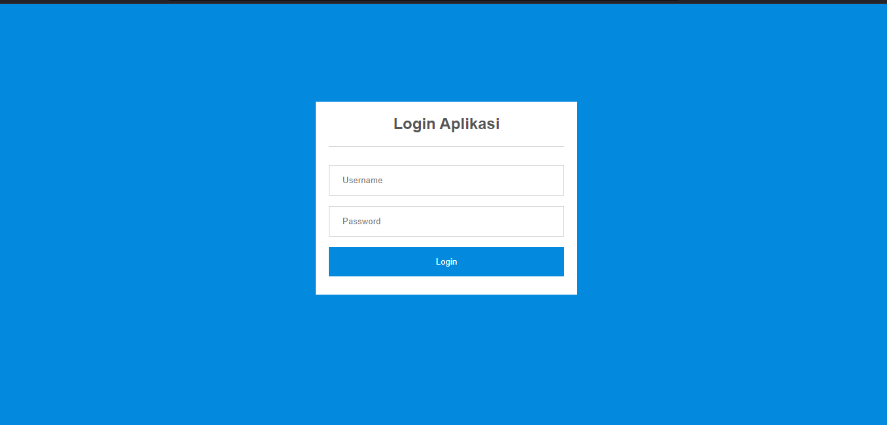
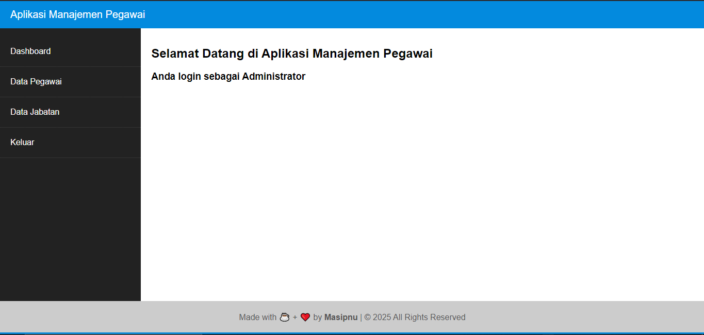

# Panduan Penggunaan

## Login Dan Hak Akses

1. Untuk memulai aplikasi anda bisa membuka browser dan memasukan alamat berikut[`http://localhost/apg`]
(http://localhost/apg).
2. Muncul tampilan halaman login.

3. Masukan username `admin` dan password `admin` untuk login sebagai administator,lalu klik **login**.
4. Selamat anda masukan kehalaman dasboard.

5. Untuk keluar anda bisa klik menu **Keluar** pasa sidebar.

## Dasboard Utama

## Manajemen Data Jabatan

### Menampilkan Data Jabatan

### Menambah Data Jabatan

### Menghapus Data Jabatan

## Menejemen Da ta Pegawai

### Menampilkan Data Pegawai

### Menambah Data Pegawai

### Memperbaharui Data Pegawai

### Menghapus Data Pegawai